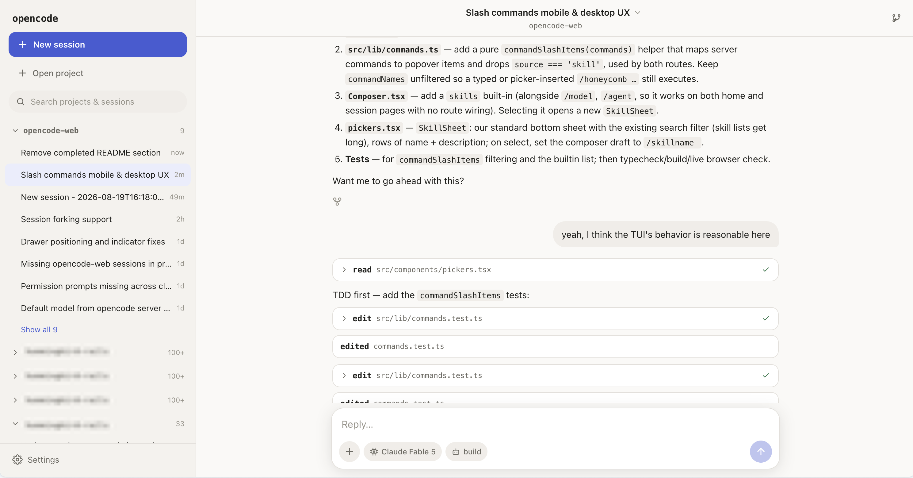
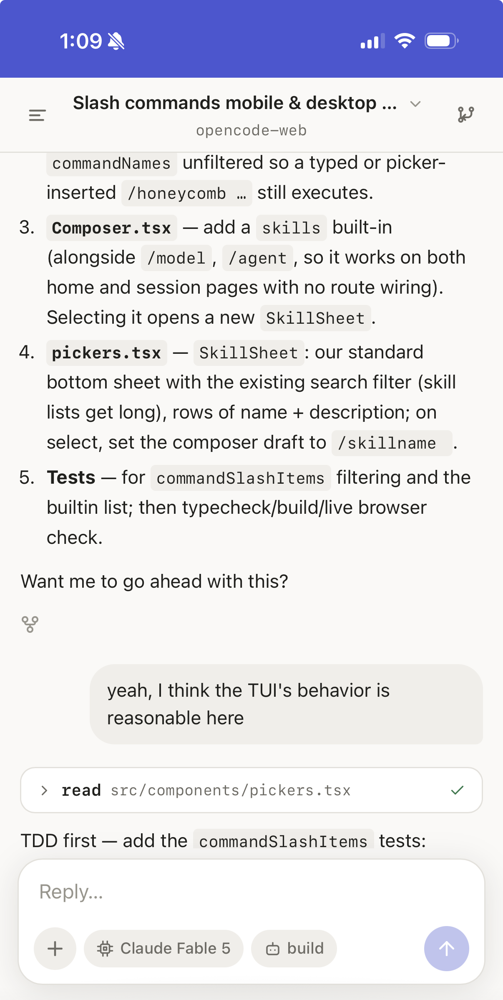

# opencode-web

A mobile-first web UI for [OpenCode](https://opencode.ai), inspired by the UX
of the Claude mobile apps. The goal is to make it pleasant to check on and
drive coding agents from a phone, while scaling up to a desktop layout with
standard responsive design.

## Interface

Use the same OpenCode projects and sessions from a persistent desktop workspace
or a focused mobile chat view.

<p align="center">
  <a href="docs/screenshots/desktop.png"></a>
  &nbsp;&nbsp;&nbsp;&nbsp;
  <a href="docs/screenshots/mobile.png"></a>
</p>

## Features

- Browse and search sessions grouped by project.
- Start and continue sessions with streaming markdown, tool calls, and diffs.
- Respond to permission requests and questions without leaving the chat.
- Attach images, PDFs, and text files to prompts.
- Switch projects, models, and agents from mobile-friendly pickers.
- Run built-in commands, server-defined commands, and OpenCode skills from the
  composer.
- Share, fork, compact, undo, redo, and export sessions.
- Install the responsive interface on a phone or use it in a desktop browser.

## How it works

opencode-web is an alternate client for OpenCode. It does not run coding agents
itself. A separate `opencode serve` process owns the projects and sessions,
runs the agents, and executes their tools. This app connects to that server and
presents the same data and controls through a responsive web interface.

The web app has its own server process, which proxies requests from the browser
to the configured OpenCode server. That connection is made by the machine
running opencode-web, so the default `localhost` OpenCode server address works
as long as the OpenCode server and opencode-web are running on the same
device, even if you are accessing the opencode-web client from a different
device. You can point the app at a different OpenCode server from the settings
page.

OpenCode remains the source of truth. Sessions created in this app are visible
in other OpenCode clients, and changes made elsewhere stream back into the web
interface.

## Running it

You need [Bun](https://bun.sh) and the
[OpenCode CLI](https://opencode.ai/docs/cli/). Start an OpenCode server in one
terminal. The directory where you run it becomes available as a project:

```sh
opencode serve
```

In another terminal, install the dependencies and start opencode-web:

```sh
bun install
bun run dev
```

Open `http://localhost:3000`. The app connects to the OpenCode server at
`http://localhost:4096` by default.

Set `VITE_OPENCODE_SERVER_URL` to override the OpenCode server URL used when
the client has not saved one in its settings. It defaults to
`http://localhost:4096`.

If your OpenCode server sets `OPENCODE_SERVER_PASSWORD`, enter the password on
the settings page. The app forwards it to OpenCode using basic authentication.
Only save a password when you access opencode-web through HTTPS or an encrypted
VPN; plain HTTP exposes the credential to the network.

### Phone access

Bind the development server to your network interface:

```sh
bun run dev -- --host 0.0.0.0
```

Open `http://<your-computer-ip>:3000` from a phone on the same network. Leave
the OpenCode server setting at `http://localhost:4096` when both server
processes run on your computer; the opencode-web server resolves that address,
not the phone.

To install the interface, use **Add to Home Screen** from Safari's share menu
on iOS. On Android, use your browser's **Install app** or **Add to Home screen**
menu item.

**Important:** binding to `0.0.0.0` will allow any device on your local network
to access your OpenCode server via opencode-web's proxy route. It's highly
recommended to instead use [Tailscale](https://tailscale.com). Put the device
running opencode-web and your mobile device into the same Tailnet, then instead
bind opencode-web's server to the private Tailnet IP:

```sh
bun run dev -- --host "$(tailscale ip -4)"
```

The opencode-web client will then be available on your mobile device at
`http://<tailscale-ip>:3000`.

### Production

Build and run the production server with:

```sh
bun run build
bun run start
```

### Development

Run the automated checks with:

```sh
bun run test
bun run typecheck
bun run build
```

## Security caveat

The proxy route is intentionally unauthenticated, and each client can choose
the server URL it targets. Anyone who can reach opencode-web can therefore
drive your OpenCode server, which executes commands on your machine. They can
also use the proxy to send requests to other services reachable from the
opencode-web host.

This is intended for personal use on a trusted machine and network. Do not
expose it directly to the public internet. Use an encrypted VPN such as
Tailscale, or an HTTPS reverse proxy that authenticates every request, for
remote access.

## License

[MIT](LICENSE)
